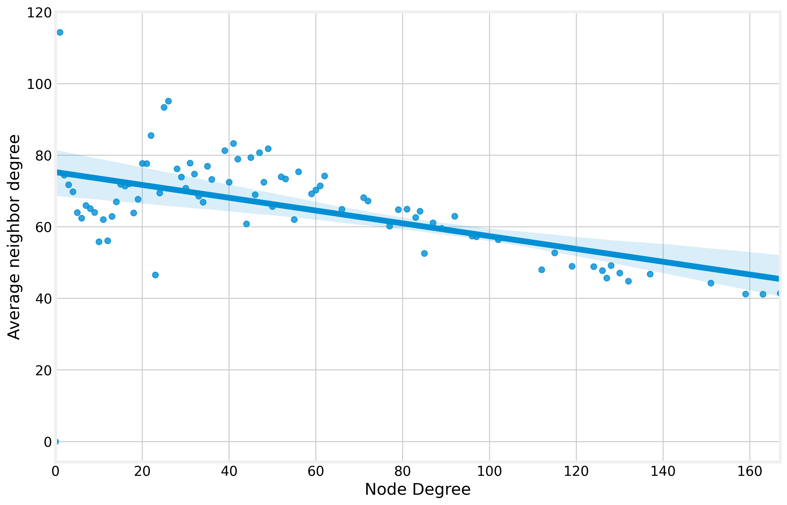
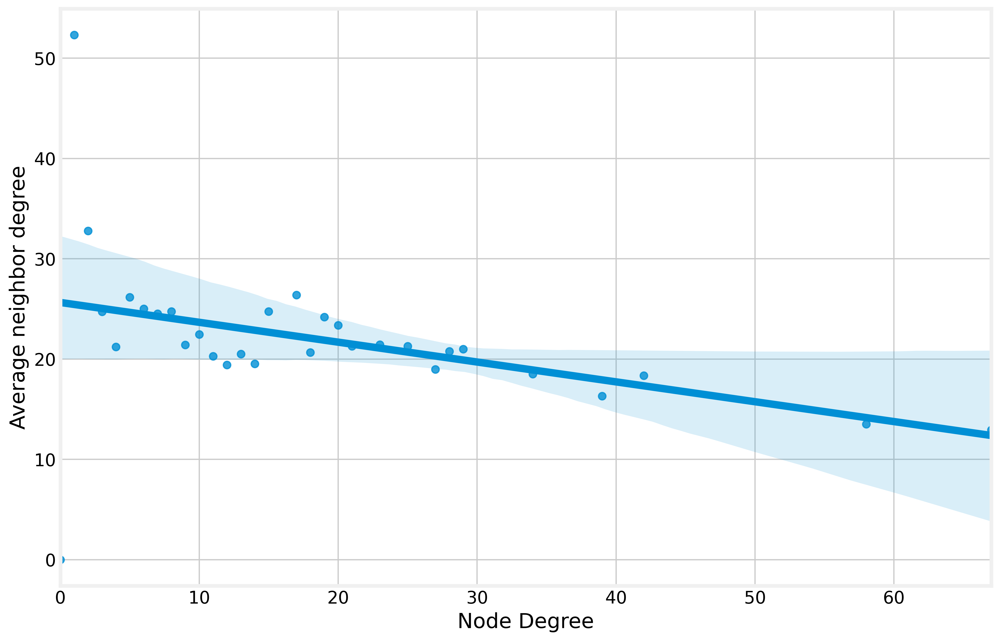
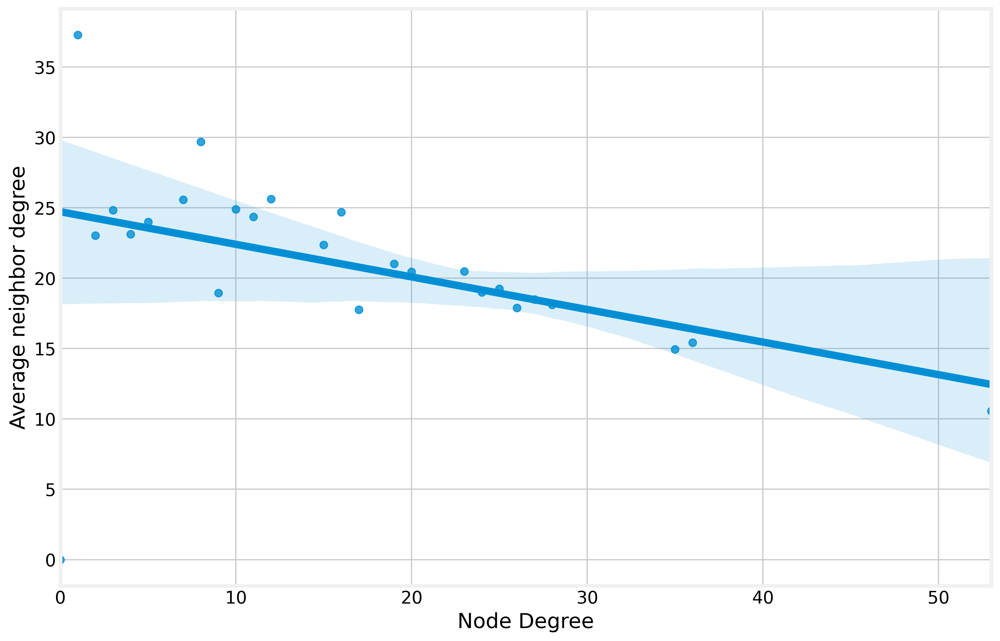
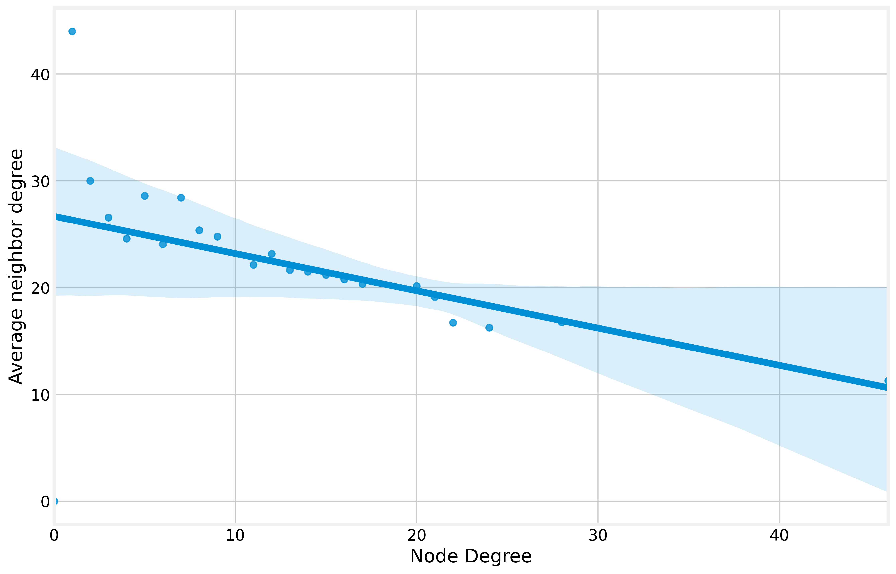
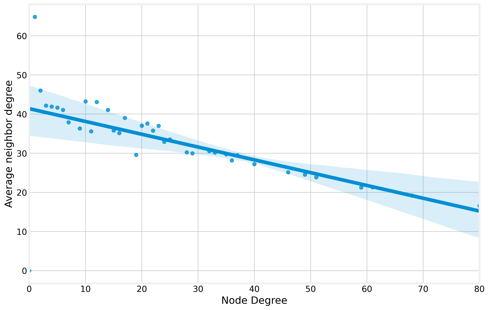
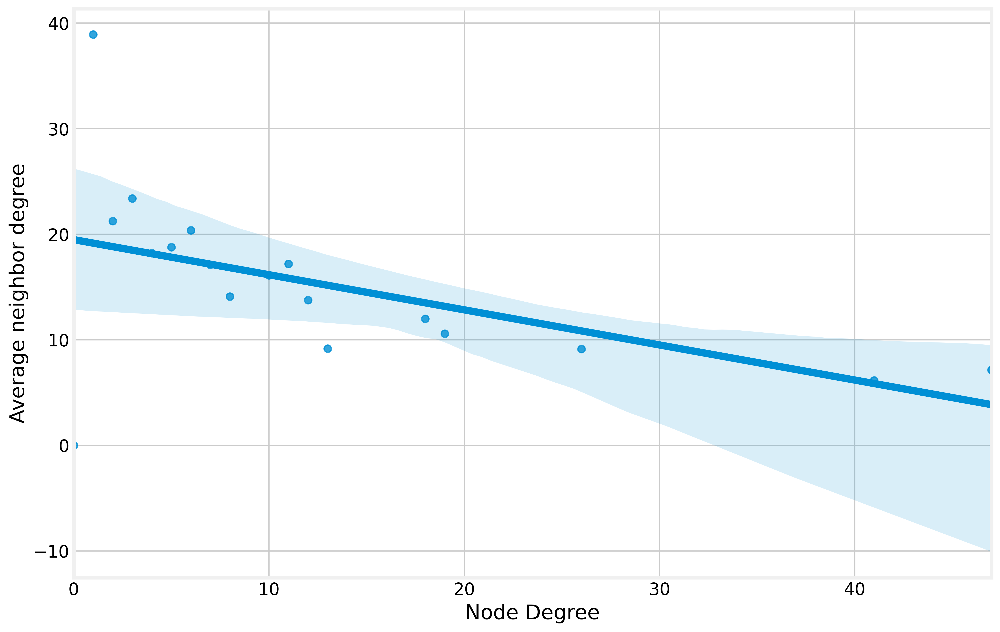

# Small Worlds Project

### Alunos:

*   Lyndon Jonhson Cabral Filho
*   Rafael Pinheiro Carlos Maia

Link do video: https://youtu.be/WYlkvgdYyl4

Não conseguimos gravar no Loom, pois não conseguimos gravar os 2 áudios, a voz da pessoa que ta gravando e a voz de outra pessoa, ele pega só da pessoa que ta gravando.

## Passos do projeto:

Neste projeto, trabalharemos com um conjunto de dados da malha aérea brasileira, que pode ser encontrada no link abaixo: https://github.com/alvarofpp/dataset-flights-brazil

## Bibliotecas utilizadas
Primeiro importamos as Bibliotecas necessárias e Instanciamos o Graphml

Para desenvolver esse projeto tivemos o auxílio das seguintes bibliotecas:

~~~python

!pip install nxviz=='0.6.3'
!pip install seaborn=='0.11.1'

import networkx as nx
import matplotlib.pyplot as plt
import numpy as np
import nxviz as nv
import seaborn as sns
import pandas as pd
~~~

~~~python
!wget --no-check-certificate "https://raw.githubusercontent.com/alvarofpp/dataset-flights-brazil/main/data/air_traffic.graphml"
~~~

## Filtrando dados para o Brasil

Atualmente, temos abaixo seguinte quantidade de nós e links com dados de diversos países.

Número de nós: 1083

Número de links: 9613

Filtrando os dados para o país Brasil.

Após filtrar os dados pelo país, temos agora a seguinte quantidade de nós e links.

Número de nós: 495

Número de links: 4402

Contudo, está faltando o dado da região e estado, então vamos acrescentá-los.

## 1. Assortatividade

Na área de grafos e ciência das redes, **assortatividade** é uma métrica utilizada para quantificar a tendência de nós individuais se conectarem a outros nós semelhantes um grafo. Além disso, é capaz de definir o comportamento dinâmico de uma rede, bem como a sua robustez, analisando o seu grau de assortatividade.

* r > 0: **assortativo**, isto é, os nós tendem a se conectar a outros com características semelhantes;
* r ≅ 0: **aleatório**, isto é, os nós tendem a se conectar a outros de maneira aleatória;
* r < 0: **dissortativo**, isto é, os nós tendem a se conectar a outros com características diferentes.

Vamos agora obter o coeficiente **r**.

r: 0.36728130173582757

Dado o nosso **r**, a rede das regiões é categorizada como **assortativa**, mas como ela não é muito maior que 0, isso indica uma tendência dos nós se conectarem aos outros de maneira aleatória.

Vamos agora gerar o gráfico de assortatividade.

## 2. Análise bivariada entre o grau do vértice e o número médio de vizinhos

A análise bivariada é uma das formas mais simples de análise quantitativa. Envolve a análise de duas variáveis, com o objetivo de determinar a relação empírica entre elas. A análise bivariada pode ser útil para testar hipóteses simples de associação.

Vamos agora criar uma função que irá pegar os dados para realizar a análise bivariada para o país e para cada região.

Ao analisar os gráficos e os coeficientes obtidos logo abaixo, verificamos que todos os coeficientes foram negativos, o que mostra que os nós de cada rede tendem a se conectar com nós de graus diferentes.

### Brasil

coeficiente de assortatividade: -0.2017097172979742

### Regiões

#### Norte

coeficiente de assortatividade: -0.22193985877089423

#### Nordeste

coeficiente de assortatividade: -0.33375735918340366

#### Sul

coeficiente de assortatividade: -0.40181381306857755

#### Sudeste

coeficiente de assortatividade: -0.3687746079424212

#### Centro-oeste

coeficiente de assortatividade: -0.3542839902086467

## 3. Componentes conectados

Neste tópico vamos determinar quantos componentes conectados existem na rede aérea brasileira. Caracterizando a quantidade a porcentagem por região.

Vamos agora criar uma função para verificar isso.

### Brasil

Número de componentes conectados: 5

### Regiões

#### Norte

Número de componentes conectados: 3

Porcentagem: 25.66%

#### Nordeste

Número de componentes conectados: 6

Porcentagem: 18.74%

#### Sul

Número de componentes conectados: 6

Porcentagem: 14.26%

#### Sudeste

Número de componentes conectados: 5

Porcentagem: 23.42%

#### Centro-oeste

Número de componentes conectados: 6

Porcentagem: 17.92%

## 4. Cenário Simulado

Vamor neste tópico fazer 4 simulações de caminhos mais curtos de uma região para outra. Sendo as seguintes simulações:

1.   De uma cidade do NORTE para uma cidade do SUL
2.   De uma cidade do SUL para ula cidade do NORDESTE
3.   De uma cidade do NORDESTE para uma cidade do CENTRO-OESTE
4.   De uma cidade do CENTRO-OESTE para uma cidade do SUDESTE

Vamos escolher a primeira cidade de cada região que encontrarmos e que seja um componente conectado.

['SJLM', 'SNHS', 'SSZW', 'SBAF', 'SWBG']

### Simulação 1 - NORTE -> SUL
~~~python
['SJLM', 'SBBV', 'SBKP', 'SSZW']
----------------------------------------
name                       PACARAIMA
state                             RR
region                         NORTE
country                       BRASIL
continent             AMÉRICA DO SUL
Código OACI                      NaN
lat_geo_point      4.151669979095459
lon_geo_point    -61.427799224853516
Name: SJLM, dtype: object
----------------------------------------
name                  BOA VISTA
state                        RR
region                    NORTE
country                  BRASIL
continent        AMÉRICA DO SUL
Código OACI                 NaN
lat_geo_point     2.84138894081
lon_geo_point    -60.6922225952
Name: SBBV, dtype: object
----------------------------------------
name                   CAMPINAS
state                        SP
region                  SUDESTE
...
lat_geo_point          -25.1847
lon_geo_point          -50.1441
Name: SSZW, dtype: object
----------------------------------------
~~~
Com o resultado obtido, verificamos que para viajar de PACARAIMA-RR para PONTA GROSSA-PR é necessário fazer um voo com mais 2 conexões para fazer essa viagem.

### Simulação 2 - SUL -> NORDESTE
~~~python
['SSZW', 'SBKP', 'SBRF', 'SNHS']
----------------------------------------
name               PONTA GROSSA
state                        PR
region                      SUL
country                  BRASIL
continent        AMÉRICA DO SUL
Código OACI                 NaN
lat_geo_point          -25.1847
lon_geo_point          -50.1441
Name: SSZW, dtype: object
----------------------------------------
name                   CAMPINAS
state                        SP
region                  SUDESTE
country                  BRASIL
continent        AMÉRICA DO SUL
Código OACI                 NaN
lat_geo_point    -23.0074005127
lon_geo_point    -47.1344985962
Name: SBKP, dtype: object
----------------------------------------
name                         RECIFE
state                            PE
region                     NORDESTE
...
lat_geo_point     -8.0623998642
lon_geo_point    -38.3288002014
Name: SNHS, dtype: object
----------------------------------------
~~~
Com o resultado obtido, verificamos que para viajar de PONTA GROSSA-RR para SERRA TALHADA-PE é necessário fazer um voo com mais 2 conexões para fazer essa viagem.

### Simulação 3 - NODESTE -> CENTRO-OESTE
~~~python
['SNHS', 'SBRF', 'SBCY', 'SWBG']
----------------------------------------
name              SERRA TALHADA
state                        PE
region                 NORDESTE
country                  BRASIL
continent        AMÉRICA DO SUL
Código OACI                 NaN
lat_geo_point     -8.0623998642
lon_geo_point    -38.3288002014
Name: SNHS, dtype: object
----------------------------------------
name                         RECIFE
state                            PE
region                     NORDESTE
country                      BRASIL
continent            AMÉRICA DO SUL
Código OACI                     NaN
lat_geo_point    -8.126489639282227
lon_geo_point    -34.92359924316406
Name: SBRF, dtype: object
----------------------------------------
name              VÁRZEA GRANDE
state                        MT
region             CENTRO-OESTE
...
lat_geo_point            -15.1934
lon_geo_point            -59.3848
Name: SWBG, dtype: object
----------------------------------------
~~~
Com o resultado obtido, verificamos que para viajar de SERRA TALHADA-PE para PONTES E LACERDA-MT é necessário fazer um voo com mais 2 conexões para fazer essa viagem.

### Simulação 4 - CENTRO-OESTE -> SUDESTE
~~~python
['SWBG', 'SBCY', 'SBGL', 'SBAF']
----------------------------------------
name             PONTES E LACERDA
state                          MT
region               CENTRO-OESTE
country                    BRASIL
continent          AMÉRICA DO SUL
Código OACI                   NaN
lat_geo_point            -15.1934
lon_geo_point            -59.3848
Name: SWBG, dtype: object
----------------------------------------
name              VÁRZEA GRANDE
state                        MT
region             CENTRO-OESTE
country                  BRASIL
continent        AMÉRICA DO SUL
Código OACI                 NaN
lat_geo_point    -15.6528997421
lon_geo_point    -56.1166992188
Name: SBCY, dtype: object
----------------------------------------
name             RIO DE JANEIRO
state                        RJ
region                  SUDESTE
...
lat_geo_point        -22.875099
lon_geo_point        -43.384701
Name: SBAF, dtype: object
----------------------------------------
~~~
Com o resultado obtido, verificamos que para viajar de PONTES E LACERDA-MT para RIO DE JANEIRO-RJ é necessário fazer um voo com mais 2 conexões para fazer essa viagem.

## 5. Coeficiente de Clusterização

Em diversas redes, é notável o padrão de que se o vértice A é conectado ao vértice B, e o vértice B é conectado ao vértice C, então haverá alta probabilidade de A também estar conectado a C. Sob o aspecto topológico, a transitividade mede a presença de triângulos na rede – conjunto de três vértices interconectados entre si. Sob o aspecto social, isso pode ser traduzido como: “um amigo de um amigo seu tem bastante chances de ser seu amigo também”.

Há uma métrica, chamada de coeficiente de clusterização, que indica a fração de triplas de vértices que são efetivamente interconectados entre si.

$C = \frac{3(\textrm{número de triangulos no grafo})}{\textrm{número de triplas de vértices conectadas}}$

Vamos agora encontrar o coeficiente de clusterização do país e de cada região.

### Brasil

0.6230508002369363

### Regiões

#### Norte

0.6159653188854738

#### Nordeste

0.43807384418290285

#### Sul

0.5979416718387065

#### Sudeste

0.6186700538769275

#### Centro-oeste

0.5618772358860067