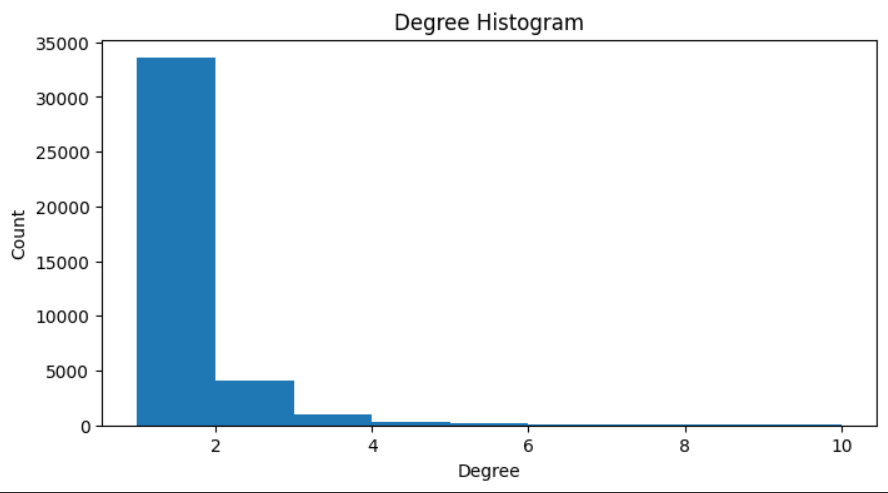
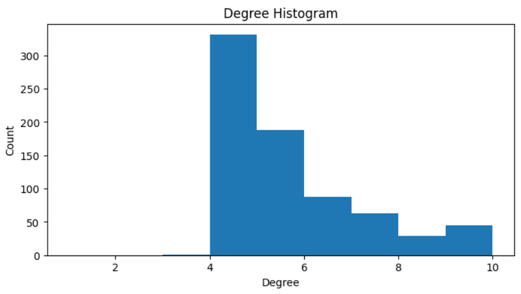
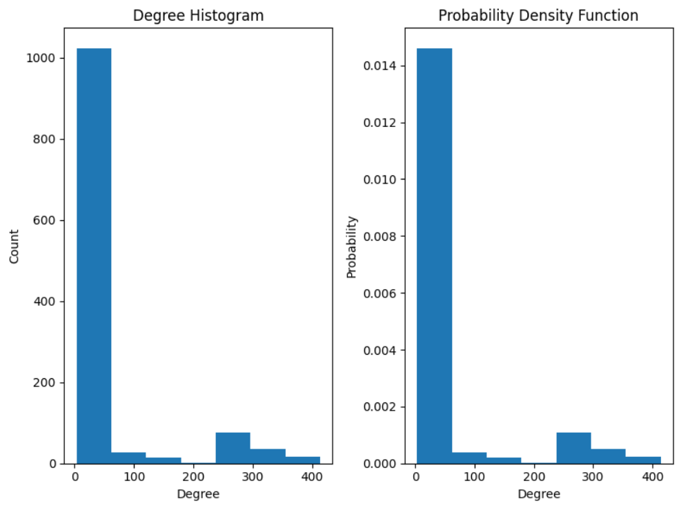
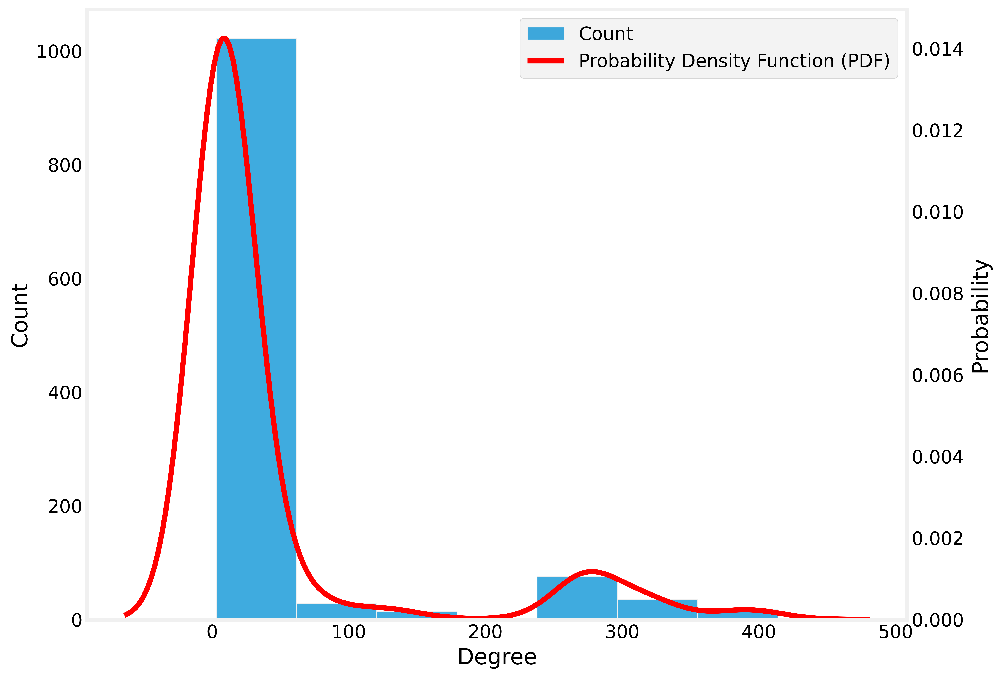
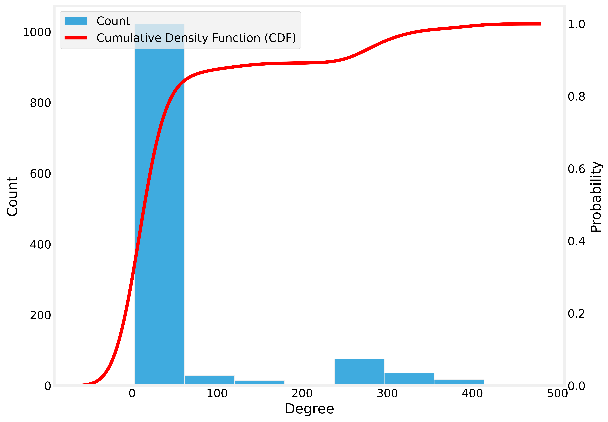
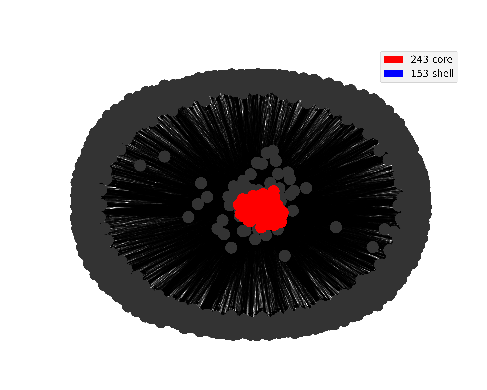

# **Wikipedia Project**

### Alunos:

*   Lyndon Jonhson Cabral Filho
*   Rafael Pinheiro Carlos Maia

### Vídeo:
*   https://www.loom.com/share/b699ccad24024ec0a34e8b26725a8336
## Bibliotecas utilizadas
Primeiro importamos as Bibliotecas necessárias
Para desenvolver esse projeto tivemos o auxílio das seguintes bibliotecas:

~~~python
!pip install wikipedia

from operator import itemgetter
import networkx as nx
import wikipedia
import matplotlib.pyplot as plt
import numpy as np
import seaborn as sns
import pandas as pd
import matplotlib.patches as mpatches
~~~

## Instanciando o Grafo
Para o projeto utilizamos um livro do Stephen King, Sob a Redoma (Under The Dome).

~~~python
# https://en.wikipedia.org/wiki/Under_the_Dome_(novel)
SEED = "Under the Dome (Novel)".title()
STOPS = ("International Standard Name Identifier",
         "Viaf (Identifier)",
         "Isni (Identifier)",
         "Isbn (Identifier)",
         "Stephen King",
         "Under the dome")
~~~

~~~python
todo_lst = [(0, SEED)] # The SEED is in the layer 0
todo_set = set(SEED) # The SEED itself
done_set = set() # Nothing is done yet
~~~

~~~python
g = nx.DiGraph()
layer, page = todo_lst[0]
~~~

~~~python
%%time
while layer < 2:
  # Remove the name page of the current page from the todo_lst,
  # and add it to the set of processed pages.
  # If the script encounters this page again, it will skip over it.
  del todo_lst[0]
  done_set.add(page)

  # Show progress
  print(layer, page)

  # Attempt to download the selected page.
  try:
    wiki = wikipedia.page(page)
  except:
    print("Could not load", page)
    layer, page = todo_lst[0]
    continue

  for link in wiki.links:
    link = link.title()
    if link not in STOPS and not link.startswith("List Of"):
      if link not in todo_set and link not in done_set:
        todo_lst.append((layer + 1, link))
        todo_set.add(link)
      g.add_edge(page, link)
  layer, page = todo_lst[0]
~~~

~~~python
print("Número de Nós: {}".format(len(g)))
print("Número de Links: {}".format(nx.number_of_edges(g)))
~~~

Número de Nós: 39975
Número de Links: 71451

## Removendo Duplicatas
Etapa necessária para remover as duplicatas presentes no dataset.

~~~python
# remove self loops
g.remove_edges_from(nx.selfloop_edges(g))

# identify duplicates like that: 'network' and 'networks'
duplicates = [(node, node + "s")
              for node in g if node + "s" in g
             ]

for dup in duplicates:
  # *dup is a technique named 'unpacking'
  g = nx.contracted_nodes(g, *dup, self_loops=False)

print(duplicates)

duplicates = [(x, y) for x, y in
              [(node, node.replace("-", " ")) for node in g]
                if x != y and y in g]
print(duplicates)

for dup in duplicates:
  g = nx.contracted_nodes(g, *dup, self_loops=False)

# nx.contracted creates a new node/edge attribute called contraction
# the value of the attribute is a dictionary, but GraphML
# does not support dictionary attributes
nx.set_node_attributes(g, 0,"contraction")
nx.set_edge_attributes(g, 0,"contraction")
~~~

~~~python
print("Número de Nós: {}".format(len(g)))
print("Número de Links: {}".format(nx.number_of_edges(g)))
~~~

Número de Nós: 39827
Número de Links: 71338

## Truncamento da Rede
Nessa etapa nós removemos os nós de grau inferior a 4. Pois como visto nos grafos gerados abaixo, há uma grande quantidade de nós com essa quantidade de grau com relação aos outros graus.

~~~python
degree_sequence = sorted([d for n, d in g.degree()], reverse=True)

fig, ax = plt.subplots(1,1,figsize=(8,4))

ax.hist(degree_sequence,bins=[1,2,3,4,5,6,7,8,9,10])

ax.set_title("Degree Histogram")
ax.set_ylabel("Count")
ax.set_xlabel("Degree")

plt.show()
~~~

~~~python
# filter nodes with degree greater than or equal to 4
core = [node for node, deg in dict(g.degree()).items() if deg >= 4]

# select a subgraph with 'core' nodes
g2 = nx.subgraph(g, core)

print("Número de Nós: {}".format(len(g2)))
print("Número de Links: {}".format(nx.number_of_edges(g2)))

nx.write_graphml(g2, "cna.graphml")
~~~

Número de Nós: 1193
Número de Links: 26623

~~~python
degree_sequence = sorted([d for n, d in g2.degree()], reverse=True)

fig, ax = plt.subplots(1,1,figsize=(8,4))

ax.hist(degree_sequence,bins=[1,2,3,4,5,6,7,8,9,10])

ax.set_title("Degree Histogram")
ax.set_ylabel("Count")
ax.set_xlabel("Degree")

plt.show()
~~~

## Medidas da Centralidade

~~~python
fig, ax = plt.subplots(2,2,figsize=(16,14))

# max value of metrics
max_centrality = max([max([v for k, v in nx.eigenvector_centrality(g2).items()]),
                      max([v for k, v in nx.degree_centrality(g2).items()]),
                      max([v for k, v in nx.closeness_centrality(g2).items()]),
                      max([v for k, v in nx.betweenness_centrality(g2).items()])])

# layout position
pos = nx.spring_layout(g2,seed=123456789,k=0.3)

# color of nodes
color_degree = list(dict(nx.degree_centrality(g2)).values())
color_closeness = list(dict(nx.closeness_centrality(g2)).values())
color_betweenness = list(dict(nx.betweenness_centrality(g2)).values())
color_eigenvector = list(dict(nx.eigenvector_centrality(g2)).values())

#
# draw edges
#
# degree centrality
nx.draw_networkx_edges(g2,
                       pos=pos,
                       alpha=0.4, ax=ax[0,0])

# closeness centrality
nx.draw_networkx_edges(g2,
                       pos=pos,
                       alpha=0.4, ax=ax[0,1])

# betweenness centrality
nx.draw_networkx_edges(g2,
                       pos=pos,
                       alpha=0.4, ax=ax[1,0])

# eigenvector centrality
nx.draw_networkx_edges(g2,
                       pos=pos,
                       alpha=0.4, ax=ax[1,1])

# draw nodes
nodes = nx.draw_networkx_nodes(g2,
                 pos=pos,
                 node_color=color_degree,
                 cmap=plt.cm.jet,vmin=0,vmax=max_centrality,
                 ax=ax[0,0])
nodes = nx.draw_networkx_nodes(g2,
                 pos=pos,
                 node_color=color_closeness,
                 cmap=plt.cm.jet,vmin=0,vmax=max_centrality,
                 ax=ax[0,1])
nodes = nx.draw_networkx_nodes(g2,
                 pos=pos,
                 node_color=color_betweenness,
                 cmap=plt.cm.jet,vmin=0,vmax=max_centrality,
                 ax=ax[1,0])
nodes = nx.draw_networkx_nodes(g2,
                 pos=pos,
                 node_color=color_eigenvector,
                 cmap=plt.cm.jet,vmin=0,vmax=max_centrality,
                 ax=ax[1,1])

#
# draw labels
#
nx.draw_networkx_labels(g2, pos=pos,
                        font_color='black', ax=ax[0,0])
nx.draw_networkx_labels(g2, pos=pos,
                        font_color='black', ax=ax[0,1])
nx.draw_networkx_labels(g2, pos=pos,
                        font_color='black', ax=ax[1,0])
nx.draw_networkx_labels(g2, pos=pos,
                        font_color='black', ax=ax[1,1])

# eliminate axis
ax[0,0].axis("off")
ax[1,0].axis("off")
ax[0,1].axis("off")
ax[1,1].axis("off")

ax[0,0].set_title("Degree Centrality")
ax[0,1].set_title("Closeness Centrality")
ax[1,0].set_title("Betweenness Centrality")
ax[1,1].set_title("Eigenvector Centrality")

plt.subplots_adjust(bottom=0., right=0.92, top=1.)
cax = plt.axes([0.95, 0.3, 0.025, 0.4])
sm = plt.cm.ScalarMappable(cmap=plt.cm.jet, norm=plt.Normalize(vmin=0, vmax=max_centrality))
cbar=plt.colorbar(sm,cax)

plt.savefig('alltogether.png', transparent=True,dpi=600,bbox_inches="tight")
plt.show()
~~~

~~~python
nx.degree_centrality(g2)
~~~

{'John Langan': 0.0041946308724832215,
 'Antihero': 0.003355704697986577,
 'Pet Sematary (2019 Film)': 0.016778523489932886,
 'Fiction': 0.003355704697986577,
 'Hearts In Atlantis (Film)': 0.015939597315436243,
 'Publishing': 0.0050335570469798654,
 'Fortune (Magazine)': 0.003355704697986577,
 'Broadcast Syndication': 0.003355704697986577,
 'The Monkey': 0.003355704697986577,
 'The Little Sisters Of Eluria': 0.022651006711409395,
 'Hallucination': 0.03523489932885906,
 'Vampire': 0.003355704697986577,
 'Salon (Website)': 0.003355704697986577,
 'Vhs': 0.003355704697986577,
 'Behavior': 0.003355704697986577,
 'Imdb': 0.010067114093959731,
 'Swan Song (Mccammon Novel)': 0.0041946308724832215,
 "Everything'S Eventual (Novella)": 0.02181208053691275,
 'Chairman': 0.003355704697986577,
 'Washington Post': 0.0041946308724832215,
 'Huffpost': 0.003355704697986577,
 'The Ringer (Website)': 0.009228187919463088,
 'American Library Association': 0.0041946308724832215,
 'Virtual Obsession': 0.003355704697986577,
 'Dolores Claiborne': 0.2273489932885906,
...
 'Tabitha King': 0.23406040268456374,
 'Charles Dickens': 0.003355704697986577,
 'Age Of Enlightenment': 0.0050335570469798654,
 'Contract Killing': 0.003355704697986577,
 ...}

~~~python
nx.closeness_centrality(g2)
~~~

{'John Langan': 0.04752783489157,
 'Antihero': 0.051427732873439026,
 'Pet Sematary (2019 Film)': 0.05382857896066521,
 'Fiction': 0.05220517737296261,
 'Hearts In Atlantis (Film)': 0.053740623766285044,
 'Publishing': 0.06566936786666491,
 'Fortune (Magazine)': 0.057801865984123804,
 'Broadcast Syndication': 0.059153348462169866,
 'The Monkey': 0.044384968616688864,
 'The Little Sisters Of Eluria': 0.04580677123254379,
 'Hallucination': 0.06793929537063724,
 'Vampire': 0.04459371199495518,
 'Salon (Website)': 0.05436241610738255,
 'Vhs': 0.047390867067674994,
 'Behavior': 0.04968293704522652,
 'Imdb': 0.07744129472317392,
 'Swan Song (Mccammon Novel)': 0.04752783489157,
 "Everything'S Eventual (Novella)": 0.04574306223222037,
 'Chairman': 0.051712675699632775,
 'Washington Post': 0.06013807702484906,
 'Huffpost': 0.06090604026845638,
 'The Ringer (Website)': 0.045727367845562174,
 'American Library Association': 0.06436254744611829,
 'Virtual Obsession': 0.047390867067674994,
 'Dolores Claiborne': 0.059303981613916694,
...
 'Tabitha King': 0.059303981613916694,
 'Charles Dickens': 0.05527607015960747,
 'Age Of Enlightenment': 0.07366367059033616,
 'Contract Killing': 0.047390867067674994,
 ...}

~~~python
nx.betweenness_centrality(g2)
~~~

{'John Langan': 0.0,
 'Antihero': 0.0,
 'Pet Sematary (2019 Film)': 0.0,
 'Fiction': 0.0,
 'Hearts In Atlantis (Film)': 0.0,
 'Publishing': 0.0,
 'Fortune (Magazine)': 0.0,
 'Broadcast Syndication': 0.0,
 'The Monkey': 0.0,
 'The Little Sisters Of Eluria': 0.0,
 'Hallucination': 0.0010811919438327247,
 'Vampire': 0.0,
 'Salon (Website)': 0.0,
 'Vhs': 0.0,
 'Behavior': 0.0,
 'Imdb': 0.0,
 'Swan Song (Mccammon Novel)': 0.0,
 "Everything'S Eventual (Novella)": 0.0,
 'Chairman': 0.0,
 'Washington Post': 0.0,
 'Huffpost': 0.0,
 'The Ringer (Website)': 1.5246320520377678e-05,
 'American Library Association': 0.0,
 'Virtual Obsession': 0.0,
 'Dolores Claiborne': 0.0007181863380771635,
...
 'Tabitha King': 0.0007252217395375487,
 'Charles Dickens': 0.0,
 'Age Of Enlightenment': 0.0,
 'Contract Killing': 0.0,
 ...}

~~~python
nx.eigenvector_centrality(g2)
~~~

{'John Langan': 0.0034031415946074225,
 'Antihero': 0.00017068472815696422,
 'Pet Sematary (2019 Film)': 0.013194783509778965,
 'Fiction': 0.00017088854100802238,
 'Hearts In Atlantis (Film)': 0.012505582101674744,
 'Publishing': 0.0009176174581951283,
 'Fortune (Magazine)': 4.966538001439152e-05,
 'Broadcast Syndication': 0.00016662449771838542,
 'The Monkey': 0.0021924574581812235,
 'The Little Sisters Of Eluria': 0.017898229632472333,
 'Hallucination': 0.002074745589300467,
 'Vampire': 0.0027249666086433225,
 'Salon (Website)': 3.86960327406219e-05,
 'Vhs': 0.002744710968188025,
 'Behavior': 3.468579520776743e-05,
 'Imdb': 0.00190192027701656,
 'Swan Song (Mccammon Novel)': 0.0034031415946074225,
 "Everything'S Eventual (Novella)": 0.017221122888619742,
 'Chairman': 2.9183580954152154e-05,
 'Washington Post': 0.00011278032055630862,
 'Huffpost': 0.00013511634998631365,
 'The Ringer (Website)': 0.0006859009360825725,
 'American Library Association': 0.0027308988751871552,
 'Virtual Obsession': 0.002744710968188025,
 'Dolores Claiborne': 0.08315781631490736,
...
 'Tabitha King': 0.08315781631490736,
 'Charles Dickens': 0.0020381980868047957,
 'Age Of Enlightenment': 0.0008725785409523567,
 'Contract Killing': 0.0027205216396847683,
 ...}

 ## Distribuição de Centralidade

~~~python
degree_sequence = sorted([d for n, d in g2.degree()], reverse=True)

fig, ax = plt.subplots(1,2,figsize=(8,6))

all_data = ax[0].hist(degree_sequence,bins=7)
ax[1].hist(degree_sequence,bins=7,density=True)

ax[0].set_title("Degree Histogram")
ax[0].set_ylabel("Count")
ax[0].set_xlabel("Degree")

ax[1].set_title("Probability Density Function")
ax[1].set_ylabel("Probability")
ax[1].set_xlabel("Degree")

plt.tight_layout()
plt.show()
~~~

~~~python
plt.style.use("fivethirtyeight")

fig, ax = plt.subplots(1,1,figsize=(10,8))

sns.histplot(degree_sequence,bins=7,label="Count",ax=ax)
ax2 = ax.twinx()
sns.kdeplot(degree_sequence,color='r',label="Probability Density Function (PDF)",ax=ax2)

lines, labels = ax.get_legend_handles_labels()
lines2, labels2 = ax2.get_legend_handles_labels()
ax2.legend(lines + lines2, labels + labels2, loc=0)

ax.grid(False)
ax2.grid(False)
ax.set_xlabel("Degree")
ax2.set_ylabel("Probability")

plt.savefig('probability_density_function.png', transparent=True,dpi=600,bbox_inches="tight")
plt.show()
~~~

~~~python
plt.style.use("fivethirtyeight")

fig, ax = plt.subplots(1,1,figsize=(10,8))

sns.histplot(degree_sequence,bins=7,label="Count",ax=ax)
ax2 = ax.twinx()
sns.kdeplot(degree_sequence,color='r',label="Cumulative Density Function (CDF)",ax=ax2,cumulative=True)

lines, labels = ax.get_legend_handles_labels()
lines2, labels2 = ax2.get_legend_handles_labels()
ax2.legend(lines + lines2, labels + labels2, loc=0)

ax.grid(False)
ax2.grid(False)
ax.set_xlabel("Degree")
ax2.set_ylabel("Probability")

plt.savefig('cumulative_density_function.png', transparent=True,dpi=600,bbox_inches="tight")
plt.show()
~~~

~~~python
bc = pd.Series(nx.betweenness_centrality(g2))
dc = pd.Series(nx.degree_centrality(g2))
ec = pd.Series(nx.eigenvector_centrality(g2))
cc = pd.Series(nx.closeness_centrality(g2))

df = pd.DataFrame.from_dict({"Betweenness": bc,
                            "Degree": dc,
                            "EigenVector": ec,
                            "Closeness": cc})
df.reset_index(inplace=True,drop=True)
df.head()

fig = sns.PairGrid(df)
fig.map_upper(sns.scatterplot)
fig.map_lower(sns.kdeplot, cmap="Reds_r")
fig.map_diag(sns.kdeplot, lw=2, legend=False)

plt.savefig('all.png', transparent=True,dpi=800,bbox_inches="tight")
plt.show()
~~~

## Decomposição de Núcleo

~~~python
set([v for k,v in nx.core_number(g2).items()])
~~~

{3,
 4,
 5,
 6,
 7,
 8,
 9,
 10,
 11,
 12,
 13,
 14,
 15,
 16,
 18,
 19,
 20,
 21,
 22,
 23,
 24,
 25,
 26,
 27,
 28,
...
 126,
 127,
 143,
 153,
 243}

~~~python
# the degree of network(g2)
fig, ax = plt.subplots(1,1,figsize=(10,8))

# Find k-cores
gplot_shell = nx.k_shell(g2, 153)
gplot_core = nx.k_core(g2, 243)

# layout position
pos = nx.spring_layout(g2,seed=123456789,k=0.3)

# draw edges
nx.draw_networkx_edges(g2,
                       pos=pos,
                       alpha=0.4, ax=ax)

# draw nodes
nodes = nx.draw_networkx_nodes(g2,
                 pos=pos,
                 node_color="#333333")

# draw nodes
nodes = nx.draw_networkx_nodes(gplot_shell,
                 pos=pos,
                 node_color="blue")

nodes = nx.draw_networkx_nodes(gplot_core,
                 pos=pos,
                 node_color="red")

# static legend
red_patch = mpatches.Patch(color='red', label='243-core')
blue_patch = mpatches.Patch(color='blue', label='153-shell')
plt.legend(handles=[red_patch,blue_patch])

plt.axis("off")
plt.savefig('k-core_sociopatterns.png', transparent=True,dpi=600)
plt.show()
~~~

